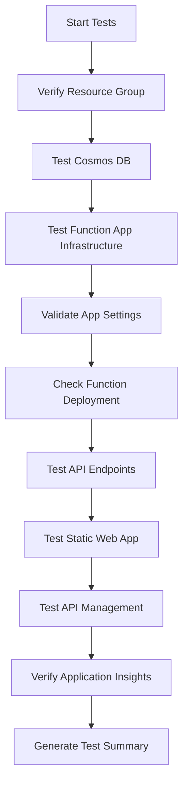

# Post-Deployment Testing Strategy

## Overview
Comprehensive post-deployment testing ensures that all infrastructure components and application endpoints are functioning correctly after deployment through the Azure DevOps pipeline.

## Testing Layers

### 1. Infrastructure Validation
- **Resource Group**: Verify existence and list all deployed resources
- **Cosmos DB**: Check connectivity, endpoint accessibility, and database/container existence
- **Function App**: Validate app state, configuration, and deployment status
- **Static Web App**: Test accessibility and response codes
- **API Management**: Verify provisioning state and gateway URL
- **Application Insights**: Confirm instrumentation setup

### 2. Function App Deep Validation
- **Critical App Settings**: Verify Azure Functions v4 required settings:
  - `AzureWebJobsFeatureFlags = EnableWorkerIndexing` (CRITICAL for v4)
  - `FUNCTIONS_WORKER_RUNTIME = node`
  - `WEBSITE_RUN_FROM_PACKAGE = 1`
  - `WEBSITE_NODE_DEFAULT_VERSION = ~22`
- **Function Discovery**: List deployed functions and their binding types
- **Runtime Status**: Confirm function app is running and responsive

### 3. API Endpoint Testing
Comprehensive HTTP endpoint validation with retry logic and error handling:

#### Test Endpoints
1. **Root Endpoint** (`/`)
   - Expected: HTTP 404 (normal for function apps)
   - Purpose: Basic connectivity test

2. **Health Check** (`/api/health`)
   - Expected: HTTP 200
   - Purpose: Application health verification

3. **Pokemon Sets** (`/api/sets`)
   - Expected: HTTP 200 with JSON response
   - Purpose: Core API functionality test

4. **Specific Set** (`/api/sets/base1`)
   - Expected: HTTP 200 with set data
   - Purpose: Parameterized endpoint test

5. **Cards in Set** (`/api/sets/base1/cards`)
   - Expected: HTTP 200 with card array
   - Purpose: Nested resource endpoint test

6. **Specific Card** (`/api/sets/base1/cards/base1-1`)
   - Expected: HTTP 200 with card details
   - Purpose: Deep nested resource test

#### Test Features
- **Retry Logic**: 3 attempts with 5-second delays
- **Timeout Handling**: 30-second request timeout
- **Response Validation**: Status code and content preview
- **Error Reporting**: Detailed failure messages
- **Summary Metrics**: Success/failure counts and overall status

## Test Execution Flow

## Success Criteria

### Infrastructure Tests
- ✅ All Azure resources exist and are accessible
- ✅ Function App is in "Running" state
- ✅ All critical app settings are configured correctly
- ✅ Functions are deployed and discoverable

### API Tests
- ✅ At least 80% of endpoints respond successfully
- ✅ Core functionality endpoints (sets, cards) are working
- ✅ Response times are within acceptable limits (< 30 seconds)
- ✅ Responses contain expected content structure

### Pipeline Integration
- ✅ Tests run automatically after deployment
- ✅ Test results are clearly reported in pipeline logs
- ✅ Pipeline variables are set for downstream tasks
- ✅ Failed tests cause pipeline to fail appropriately

## Error Handling Strategy

### Retry Logic
- **Network Issues**: Automatic retry with exponential backoff
- **Temporary Failures**: 3 attempts with 5-second delays
- **Timeout Handling**: 30-second request timeout with clear error messages

### Failure Classification
- **Critical Failures**: Missing infrastructure, wrong app settings
- **Warning Issues**: Some endpoints failing, unexpected response codes
- **Informational**: Performance issues, content warnings

### Reporting
- **Success**: Green checkmarks with response previews
- **Warnings**: Yellow warnings with retry information
- **Failures**: Red errors with detailed diagnostic information

## Test Data Requirements

### Default Test Values
- **Set ID**: `base1` (Pokemon Base Set 1)
- **Card ID**: `base1-1` (Alakazam card)
- **Expected Response**: JSON format with Pokemon card data

### Fallback Strategy
If default test data fails:
1. Try alternative common set IDs (`base2`, `jungle`, `fossil`)
2. Use generic endpoints without specific IDs
3. Report data availability issues separately from infrastructure issues

## Monitoring and Alerting

### Pipeline Variables
- `ApiTestsPassed`: Boolean indicating if any API tests succeeded
- Used by downstream tasks for conditional execution

### Notifications
- Test results included in pipeline email notifications
- Detailed logs available in Azure DevOps pipeline history
- Integration with monitoring dashboards for trend analysis

## Maintenance and Updates

### Regular Updates
- Review test endpoints quarterly
- Update test data as application evolves
- Enhance error handling based on production issues

### Performance Monitoring
- Track test execution times
- Monitor success rates over time
- Identify patterns in failures for proactive fixes

## Benefits for Portfolio

### DevOps Excellence
- **Comprehensive Testing**: Shows understanding of testing pyramid
- **Enterprise Patterns**: Retry logic, error handling, monitoring
- **Automation**: Fully automated post-deployment validation

### Technical Skills
- **PowerShell Scripting**: Advanced scripting with error handling
- **API Testing**: HTTP endpoint validation and response parsing
- **Azure CLI**: Infrastructure validation and resource querying
- **Pipeline Integration**: Variables, conditions, and reporting

### Problem-Solving
- **Proactive Monitoring**: Catch issues before users do
- **Detailed Diagnostics**: Clear error messages for quick resolution
- **Resilient Design**: Handle network issues and temporary failures

This testing strategy demonstrates enterprise-grade DevOps practices and provides confidence in deployment quality.
